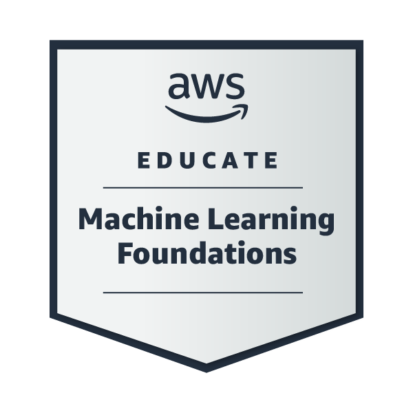

<a href="https://www.credly.com/badges/24808b39-126b-49ed-b7bc-d8b473e93e09/public_url"></a>

# AWS Udacity Nanodegree

Welcome to my repository for the AWS Udacity Nanodegree program!  
This repo documents my journey mastering the fundamentals of generative AI, machine learning, and responsible AI deployment using AWS tools and modern AI techniques.

---

## 🌟 Program Overview

This program is designed to help learners:
- Master the fundamentals of generative AI and understand its historical context and real-world applications.
- Explore AI and machine learning foundations using AWS tools, including large language models (LLMs) with transformer-based architectures.
- Examine the societal impacts of generative AI, focusing on AI's evolution and ethical deployment.
- Engage in hands-on exercises covering AI history, ML approaches, prompt engineering, and responsible AI use.
- Develop practical skills in distinguishing AI from ML, exploring LLMs, and emphasizing ethical AI deployment.

**Prerequisites:**  
Basic Python programming knowledge.

---

## 📚 Curriculum & Projects

### Phase 1: Generative AI Foundations

| #  | Type     | Title/Description                                                                                  | Status    |
|----|----------|---------------------------------------------------------------------------------------------------|-----------|
| 1  | Lesson   | Getting Started: Program resources, community, and schedule                                       | Complete  |
| 2  | Lesson   | Getting Help: How to get support and engage with the community                                    | Complete  |
| 3  | Lesson   | Artificial Intelligence in Context: AI history, societal impact, and industry applications        | Complete  |
| 4  | Lesson   | Fundamentals of AI and ML: Relationship, types, approaches, and generative AI                    | Complete  |
| 5  | Project  | Project 1: Earn your AWS Educate Machine Learning Foundations Credly Badge                        | Complete  |
| 6  | Lesson   | Using Large Language Models (LLMs): Evolution, architectures, prompt engineering, fine-tuning     | Complete  |
| 7  | Project  | Project 2: PartyRock App – Create an Amazon PartyRock App                                         | Complete  |
| 8  | Lesson   | Real-world Applications of Generative AI: Societal impact, ethics, diversity, and policy          | Complete  |
| 9  | Lesson   | Key Highlights After Graduation: Summary and next steps                                           | Complete  |

---

## 📂 Repository Structure

```
/
├── notebooks/                # Jupyter notebooks for assignments and experiments
│   ├── EnergyEfficiency.ipynb
│   ├── NeuralNetworks.ipynb
│   ├── PredictCustomerChurn.ipynb
│   └── VehicleClustering.ipynb
├── scripts/                  # Utility scripts
│   └── main.py
├── src/                      # For future reusable Python code
├── data/                     # For future datasets
├── models/                   # For future saved models
├── requirements.txt
├── pyproject.toml
├── README.md
└── .python-version
```
---

## 🙏 Acknowledgments

- [Udacity](https://www.udacity.com/)
- [AWS Educate](https://aws.amazon.com/education/awseducate/)
- All instructors and contributors to the AWS Udacity Nanodegree program
